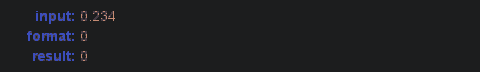

[](https://opensource.org/licenses/MIT)
[](https://npmtrends.com/@datadocs/formatter)
<!-- BEGIN FROZEN IMAGE https://github.com/datadocs/rose-formatter/actions/workflows/validate.yml/badge.svg as validation.svg -->
  
<!-- END FROZEN IMAGE -->

Read the blog post <a href="https://www.datadocs.com/blog/so-many-data-formats-to-chose-from">here</a>.
## Setup

``` bash
npm install # downloads dependencies
npm generate # generates parse-format.js from parse-format.pegjs
npm test
```

## Examples

### Fixed and scientific format
You can work with different number of decimal figures. Adding `0` makes a figure always visible, even if it is a leading or trailing zero


We can use `#` to only show figures that contribute to a better approximation of the number


### Rational format

The fractional formats can be represented as fractions instead of decimal positional representation, e.g. showing `1 1/3` instead `1.6666666667`.
The denominator can be fixed, where the value will be approximating choosing the numerator. Or can be free limitted to a certain number of digits, e.g.
the format `0 0/00` will show the number as the integer part followed by a fraction whose denominator is less than `100`.


## Percentage

If the format contains a `%` suffix, it will convert the number using to a percentage using the relation `100% = 1` (You could also use multiple percent symbols, and the rule will be applied repeatedly untill all are substitued).



## Number masks

In some applications the user might want to show a number formatted mixing some place holder symbols and the digits of the number, e.g. a phone number `(00) 0000-0000`.
Some characters may have special meaning, they can be made literal by preceding them by a `\` or quoting `"`.


## Dates

Numbers are interpreted as days, accordingly to the excel interpretation, there are many tokens that represents parts of date

| Symbol | Inerpretation                                                                                    |
| ------ | ------------------------------------------------------------------------------------------------ |
| d      | day of the month, as a single digit                                                              |
| dd     | two-digit day of the month, possibly with a leading zero                                         |
| ddd    | Abbreviated day of the week, represented by the thee initial letters                             |
| dddd   | Day of the week                                                                                  |
| m      | single digit month number if the last seen symbol was a date part, otherwise single digit minute |
| mm     | two-digit month number if the last seen symbols was a date part, otherwise two-digit minute      |
| y or yy| Two digit year                                                                                   |
| yyy+   | Four digit year                                                                                  |
| h      | single digit hour                                                                                |
| hh+    | two-digit hour, possibly with leading zero                                                       |
| s      | single digit second                                                                              |
| ss+    | two-digit second                                                                                 |
| A/P    | Instead of 24h time, use 12h with A or P suffix                                                  |
| am/pm  | Use 12h time with AM or PM suffix                                                                |

The `+` in the above table indicate that the preceding letter may repeat one or more times.


In addition to the above it is possible, for instance, to use `[h]`, `[m]`, `[s]` to show durations in
hours, minutes or seconds, respectively.


## Aligned scientific notation

The scientific notation can be restricted to use exponents that are multiple of a given value by 
adding more than one digit place holder, e.g `#E+#` would use any exponent, `##E+#` would use only
even exponents, and so on.


## Thousands separator

By using a comma followed by a integer digit mask introduces thousands separators to the number


## Thousand multipliers and conditional formatting
By adding a comma at the end of the integer part mask the number will represented divided by `1000`, this may be used multiple times.
The next example shows how to use conditional formatting to show thousands, millions or billions accordingly to the number magnitude.


## Tests

### Basic syntax

The basic syntax makes sure that the parser accepts the <a href=http://download.microsoft.com/download/6/A/8/6A818B0B-06F4-4E41-80DE-D383A3B89865/TEXT%20function%20examples.xlsx download="TEXT function examples.xlsx">examples</a> given in the [Excel text function documentation](https://support.microsoft.com/en-us/office/text-function-20d5ac4d-7b94-49fd-bb38-93d29371225c).


### Format parsing

The format string is parsed using [peggyjs](https://peggyjs.org/), the parser produces a serializable JS object that can then be processed by a renderer alongside with the data.

Once the render is constructed one can invoke renderization methods without processing the format again. So in an application where there is much cells to be rendered than distinct formats, renderers can be cached and looked up when a a new data entry must be formatted.

### Text rendering

To illustrate the renderer a TextRenderer was implemented.


```javascript
const {TextRenderer} = require('@datadocs/rose-formatter')

const r1 = new TextRenderer('# #/###')
console.log(r1.formatNumber(Math.PI))
```

```text
'3 16/113'
```

A renderer could produce any type of output, e.g. an image, a HTML formatted text, or render it on a canvas.

Many more usage examples can be found in `./test/*.spec.js`.
